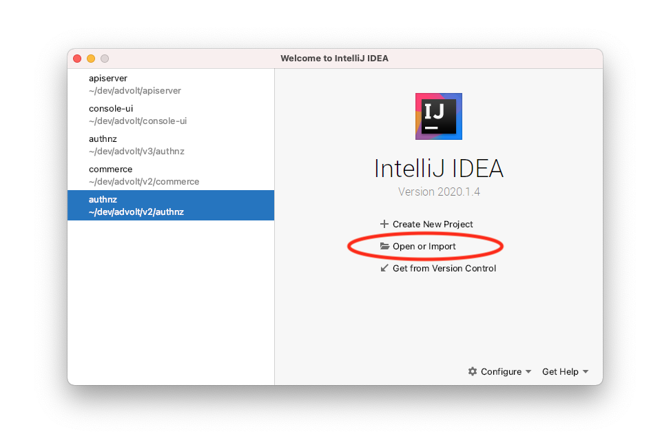
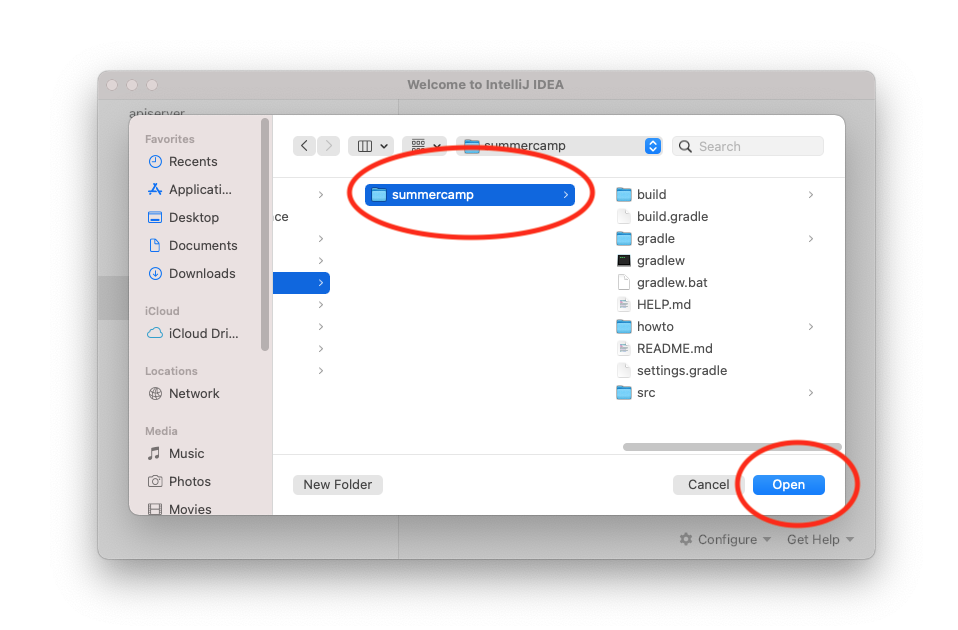
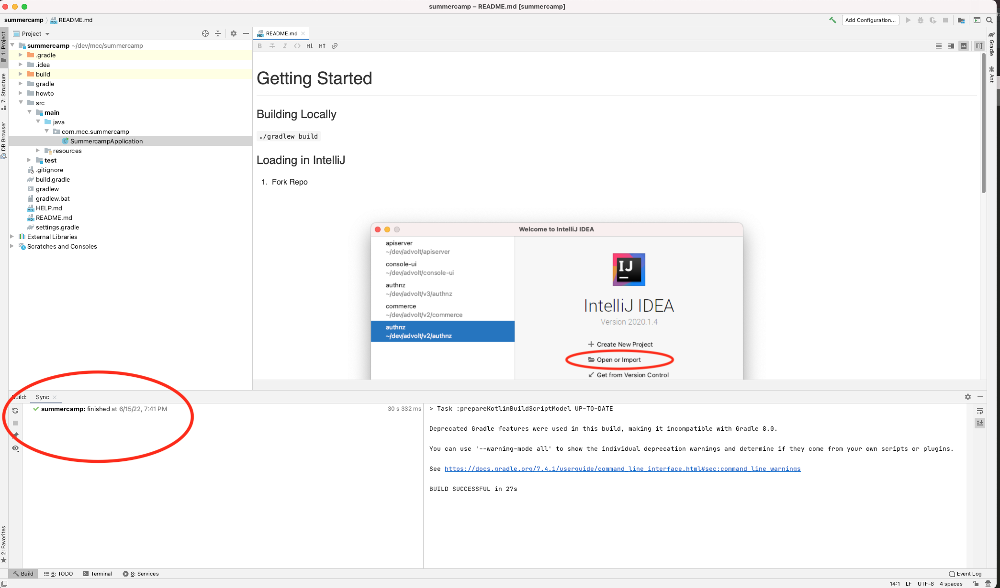

# Getting Started

### Building Locally

`./gradlew build`

### Loading in IntelliJ

1. Fork Repo
2. Choose Import 
3. Navigate to project and open it 
4. Wait patiently until project fully loads in IntelliJ 

